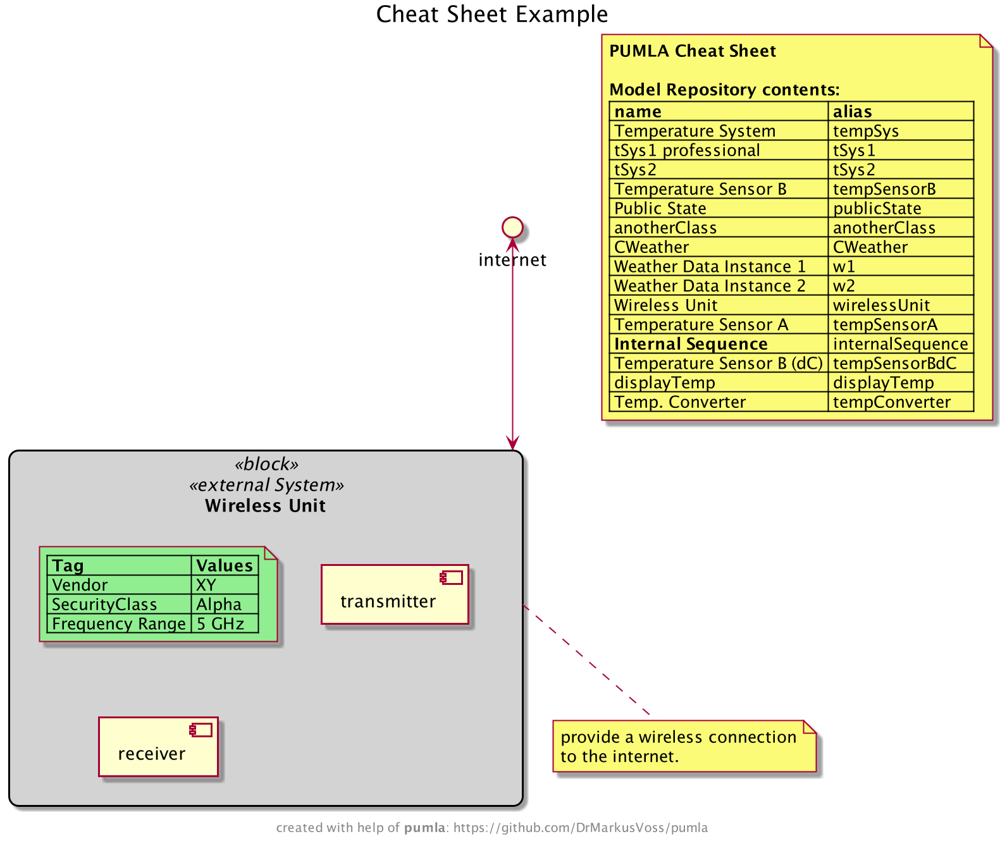

# `pumla` usage examples
These are diagrams from the `./test/examples` section. You find the
source code of the .puml files that form the example model repository
there.

## E#1: Show all Elements
[./test/examples/allElements.puml](./test/examples/allElements.puml)

## E#2: Cheat Sheet
### E#2.1: Simple Cheat Sheet
[./test/examples/cheatSheet.puml](./test/examples/cheatSheet.puml)

### E#2.2: Cheat Sheet with all attributes
[./test/examples/cheatSheetAdvanced.puml](./test/examples/cheatSheetAdvanced.puml)

## E#3: Instantiation

[./test/examples/instantiationExample.puml](./test/examples/instantiationExample.puml)

### E#3.1: `$PUMVarShowInstantiationRel = %true()`

### E#3.2: `$PUMVarShowInstantiationRel = %false()`

### E#4: Show dedicated elements, hide some unwanted internal ones
[./test/examples/easyOverviewSysVarB.puml](./test/examples/easyOverviewSysVarB.puml)

### E#5: Definition of a re-usable model element
[./test/examples/wirelessUnit/wirelessUnit.puml](./test/examples/wirelessUnit/wirelessUnit.puml)

### E#6: Element injection
Only element "tempSys" is put on the diagram, but internals are shown.
If you look at the definition of the "tempSys" model element, you do not see the internals
defined. They are injected via the "PUMLAInjectChildElements" macro. This tells
pumla to insert into this element all other elements that call "tempSys" their parent in
the second line of the .puml file. That way, the parent element definition does
not need to be changed when another child has been created. The children themselves are
designed for usage in the parent context, so they should not be used without their parent.

See the "PUMLAInjectChildElements" macro call in this file:

[./test/examples/tempSys.puml](./test/examples/tempSys.puml)

See the reference to the parent element "tempSys" in the
second line of this file. That makes it appear as part
within the "tempSys" element when the internals of "tempSys"
are shown:

[./test/examples/displayTemp/displayTemp.puml](./test/examples/displayTemp/displayTemp.puml)

See that there is only one element, the "tempSys" element,
put onto the diagram of this file:

[./test/examples/injectedElementsExample.puml](./test/examples/injectedElementsExample.puml)

See the resulting diagram for that file:

