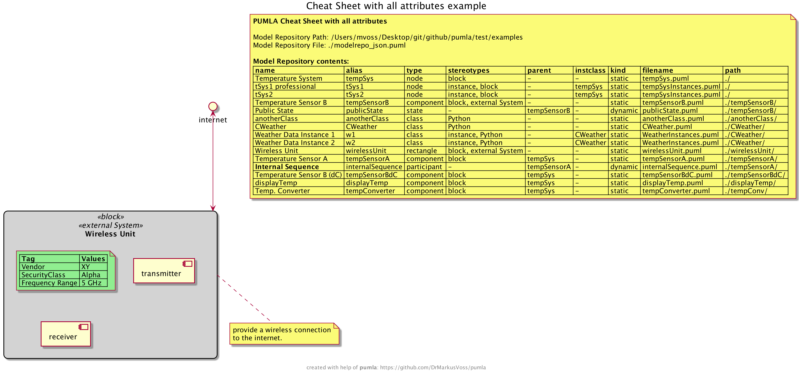
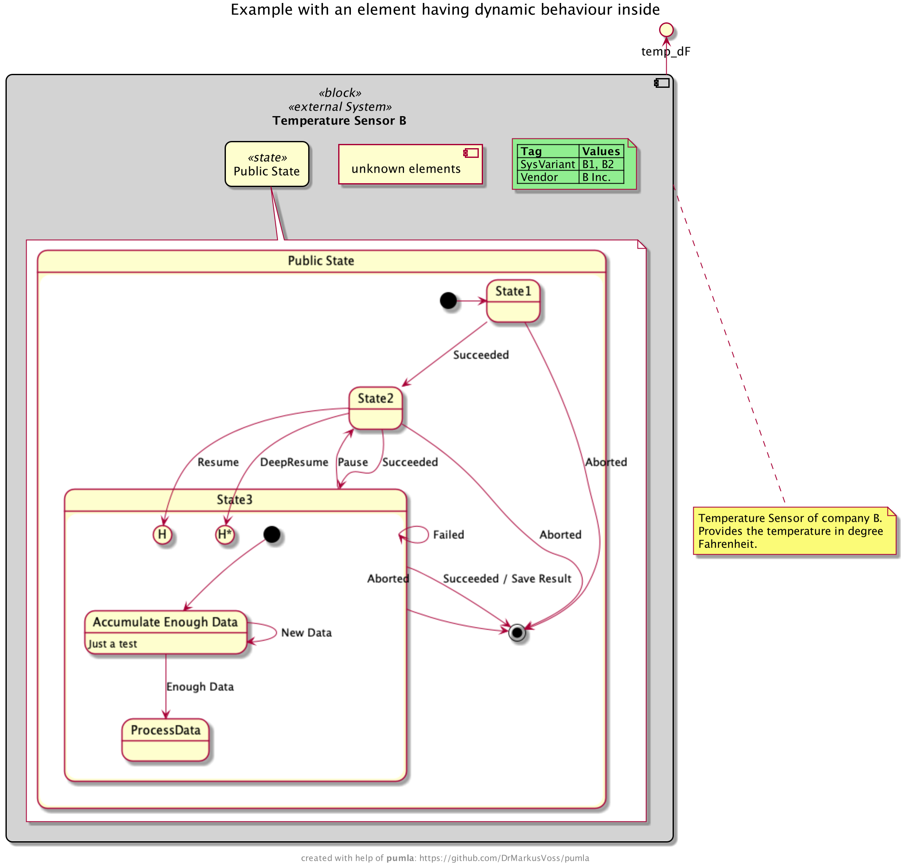
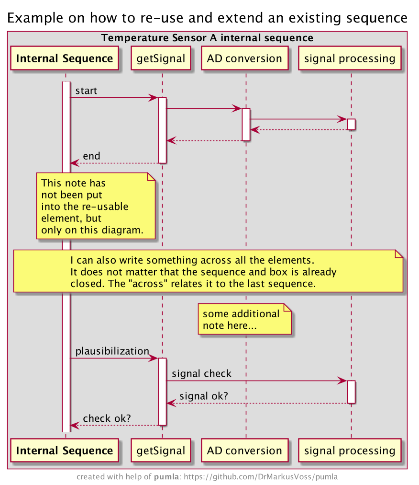

# `pumla` usage examples
These are diagrams from the `./test/examples` section. You find the
source code of the .puml files that form the example model repository
there. In order to get the example running on your computer, you need
to run "`python ./../../pumla.py update`" in the examples directory, 
because the paths in the model repo file (./test/examples/modelrepo_json.puml)
need to be updated to the directory structure on your computer. Currently
the model repo file has the paths from the structure as I have it on my
machine. You can't run the pumla update from the main path of pumla, as
it is setup to update the architecture model repo of the pumla tool itself.
The examples section will be ignored from the top level. So you have to go
down to the examples and call the pumla update from that directory.

## E#1: Show all Elements
See, how classes and other elements are mixed on this diagram. That works only
when internals are not shown. If you want to expose internals, you need to wrap
the classes into notes. Use the "`PUMLAPutAllElementsMix()`" macro for that
purpose (see example from the main page).

[./test/examples/allElements.puml](./test/examples/allElements.puml)

## E#2: Cheat Sheet
### E#2.1: Simple Cheat Sheet
[./test/examples/cheatSheet.puml](./test/examples/cheatSheet.puml)

### E#2.2: Cheat Sheet with all attributes
[./test/examples/cheatSheetAdvanced.puml](./test/examples/cheatSheetAdvanced.puml)

## E#3: Instantiation

[./test/examples/instantiationExample.puml](./test/examples/instantiationExample.puml)

### E#3.1: `$PUMVarShowInstantiationRel = %true()`

### E#3.2: `$PUMVarShowInstantiationRel = %false()`

### E#4: Show dedicated elements, hide some unwanted internal ones
[./test/examples/easyOverviewSysVarB.puml](./test/examples/easyOverviewSysVarB.puml)

### E#5: Definition of a re-usable model element
[./test/examples/wirelessUnit/wirelessUnit.puml](./test/examples/wirelessUnit/wirelessUnit.puml)

### E#6: Element injection
Only element "tempSys" is put on the diagram, but internals are shown.
If you look at the definition of the "tempSys" model element, you do not see the internals
defined. They are injected via the "PUMLAInjectChildElements" macro. This tells
pumla to insert into this element all other elements that call "tempSys" their parent in
the second line of the .puml file. That way, the parent element definition does
not need to be changed when another child has been created. The children themselves are
designed for usage in the parent context, so they should not be used without their parent.

See the "PUMLAInjectChildElements" macro call in this file:

[./test/examples/tempSys.puml](./test/examples/tempSys.puml)

See the reference to the parent element "tempSys" in the
second line of this file. That makes it appear as part
within the "tempSys" element when the internals of "tempSys"
are shown:

[./test/examples/displayTemp/displayTemp.puml](./test/examples/displayTemp/displayTemp.puml)

See that there is only one element, the "tempSys" element,
put onto the diagram of this file:

[./test/examples/injectedElementsExample.puml](./test/examples/injectedElementsExample.puml)

See the resulting diagram for that file:

### E#7: Classes
This example shows how classes can be re-used.

See this file, for how the public and private methods are handled differently in the
definition of a re-usable class:

[./test/examples/CWeather/CWeather.puml](./test/examples/CWeather/CWeather.puml)

See here, how instances of the class element are created, which is similar to the
creation of other instances:

[./test/examples/CWeather/WeatherInstances.puml](./test/examples/CWeather/WeatherInstances.puml)

See here how the class, the class instances and another non-class-diagram-compatible
element are mixed on one diagram:

[./test/examples/classesExample1.puml](./test/examples/classesExample1.puml)

### E#8: Dynamic Behaviour - State Machine
In the following example, we just put the "Temperature Sensor B" element onto the
diagram.
[./test/examples/exampleDynBehStateMachine.puml](./test/examples/exampleDynBehStateMachine.puml)

This leads to this nice diagram, as internals are shown for that element, both
static and dynamic internals:

That element has both, static and dynamic elements in its inside, see here in this file:

[./test/examples/tempSensorB/tempSensorB.puml](./test/examples/tempSensorB/tempSensorB.puml)

In order to be able to mix static and dynamic elements (PlantUML has limited capabilities regarding that),
the different `pumla` macros take care of that by wrapping the dynamic element details diagram into
a note. That way, static and dynamic world can co-exist. In order to create traceability between
the elements, pumla doubles the dynamic element as a rectangle and attaches the note to it.
That way you can also create links between the static and dynamic elements.

See here, how the dynamic element is defined, which is conceptually similar to the static
re-usable element definitions:

[./test/examples/tempSensorB/publicState.puml](./test/examples/tempSensorB/publicState.puml)

So basically, it uses the same `pumla` mechanism, the file marking and the PUMLAPARENT. The parent
mechanism is not really necessary for this example, but it fits logically. Additionaly, re-usable
description files of dynamic elements must be marked with PUMLADYN. That is because it is almost
impossible to differentiate a static and a dynamic description from one another. On the other hand
there are a lot of pitfalls when you try to mix them, which is a problem for the re-use use case. 
That is why in `pumla` you explicitly mark the dynamic descriptions.

### E#9: Dynamic Behaviour - Sequence Diagram
In the following example, we just put the "Temperature Sensor A" element onto the
diagram.
[./test/examples/exampleDynBehSequence.puml](./test/examples/exampleDynBehSequence.puml)

This leads to this nice diagram, as internals are shown for that element, both
static and dynamic internals:

That element has both, static and dynamic elements in its inside, see here in this file:

[./test/examples/tempSensorA/tempSensorA.puml](./test/examples/tempSensorA/tempSensorA.puml)

In order to be able to mix static and dynamic elements (PlantUML has limited capabilities regarding that),
the different `pumla` macros take care of that by wrapping the dynamic element details diagram into
a note. That way, static and dynamic world can co-exist. In order to create traceability between
the elements, pumla doubles the dynamic element as a rectangle and attaches the note to it.
That way you can also create links between the static and dynamic elements.

See here, how the dynamic element is defined, which is conceptually similar to the static
re-usable element definitions:

[./test/examples/tempSensorA/internalSequence.puml](./test/examples/tempSensorA/internalSequence.puml)

So basically, it uses the same `pumla` mechanism, the file marking and the PUMLAPARENT. The parent
mechanism is not really necessary for this example, but it fits logically. Additionaly, re-usable
description files of dynamic elements must be marked with PUMLADYN. That is because it is almost
impossible to differentiate a static and a dynamic description from one another. On the other hand
there are a lot of pitfalls when you try to mix them, which is a problem for the re-use use case. 
That is why in `pumla` you explicitly mark the dynamic descriptions.

### E#10: Dynamic Behaviour - Re-using and extending a Sequence Diagram
If you have a dynamic element like "internalSequence" and put it onto a diagram like here...

[./test/examples/exampleSimpleReUseSequence.puml](./test/examples/exampleSimpleReUseSequence.puml)

... then you get automatically a sequence diagram which looks like this:

Now, you can extend this diagram, by referencing the elements from inside this re-usable description and
using it for further messages/calls or additional notes.

Look into this example, that takes the "internalSequence" and extends it with several
notes and additional messages:

[./test/examples/exampleReUseAndModifyBehaviour.puml](./test/examples/exampleReUseAndModifyBehaviour.puml)

The result is then the following diagram:

### E#11: Dynamic Behaviour - Re-using and extending a State Machine 

tbd.

### E#12: Using Tagged Values as selection mechanism
Example code:

[./test/examples/taggedValuesFromMR.puml](./test/examples/taggedValuesFromMR.puml)

Example diagram:

tbd.
